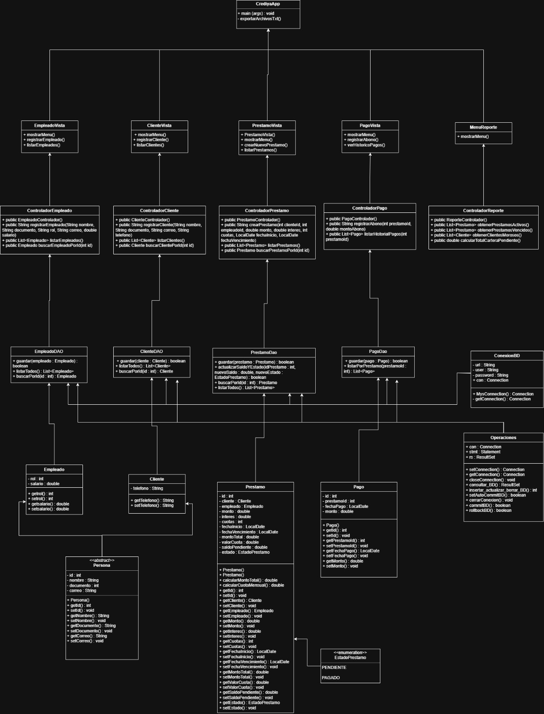
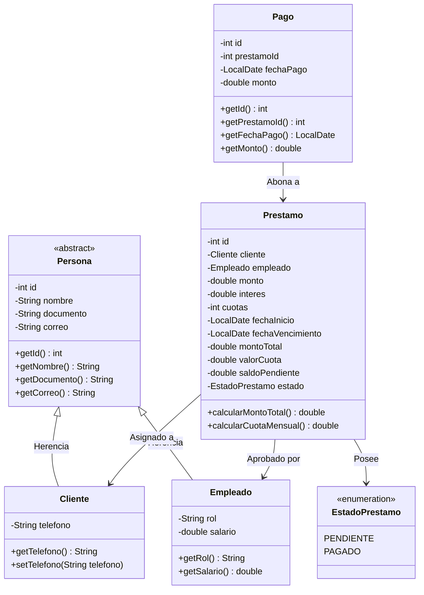

#  Sistema de Gestión de Préstamos y Cobranzas — CrediYa S.A.S.

[](https://www.oracle.com/java/)
[](https://maven.apache.org/)
[](https://www.mysql.com/)
[](#arquitectura-del-sistema)
[](#)

Solución de software modular desarrollada en **Java** bajo el paradigma de **Programación Orientada a Objetos (POO)** y la arquitectura **MVC (Modelo-Vista-Controlador)** junto con los patrones de diseño **DAO (Data Access Object)** y **Singleton** (para la gestión de conexión única y reutilizable a la base de datos). Diseñada para sistematizar y digitalizar el ciclo operativo de créditos, amortizaciones, cobranzas y análisis financiero de la microfinanciera **CrediYa S.A.S.**

---

## Tabla de Contenidos
1. [Descripción General](#-descripción-general)
2. [Características Principales](#-características-principales)
3. [Principios de POO Aplicados](#-principios-de-programación-orientada-a-objetos-poo)
4. [Arquitectura del Sistema](#-arquitectura-del-sistema)
5. [Diagrama de Clases UML](#-diagrama-de-clases-uml)
6. [Persistencia y Base de Datos](#-persistencia-y-base-de-datos)
7. [Reportes con Java Stream API y Lambdas](#-reportes-con-java-stream-api-y-lambdas)
8. [Estructura del Proyecto](#-estructura-del-proyecto)
9. [Requisitos del Entorno](#-requisitos-del-entorno)
10. [Instrucciones de Instalación y Ejecución](#-instrucciones-de-instalación-y-ejecución)
11. [Gestión de Errores y Jerarquía de Excepciones](#️-gestión-de-errores-y-jerarquía-de-excepciones)
12. [Autor](#-autor)

---

##  Descripción General

Antes de esta solución, **CrediYa S.A.S.** gestionaba sus colocaciones crediticias y cobranzas en hojas de cálculo manuales, lo que generaba duplicidad de datos, falta de trazabilidad en las fechas de vencimiento, errores en el cálculo de intereses y dificultades para identificar clientes en mora.

Esta aplicación de consola interactiva y robusta automatiza:
- El registro validado en tiempo real de clientes y asesores/empleados.
- La colocación de préstamos con cálculo automatizado de interés, monto total y valor de cuota fija.
- El registro de abonos parciales o totales, deduciendo el saldo en tiempo real y cambiando automáticamente el estado a `PAGADO` cuando se liquida la deuda.
- Generación de reportes analíticos de cartera utilizando **Java Streams**.
- Persistencia híbrida mediante **MySQL** (para transaccionalidad relacional) y **Archivos Planos TXT** (para respaldos e interoperabilidad).

---

##  Características Principales

* **Operaciones CRUD Completas**: Capacidad de Crear (Create), Leer/Listar (Read), Modificar (Update) y Eliminar (Delete) en todos los módulos: Clientes, Empleados, Préstamos y Pagos/Abonos.
* **Manejo Granular de Excepciones**: Captura jerárquica de excepciones específicas en controladores y vistas (`NumberFormatException`, `DateTimeParseException`, `IllegalArgumentException`, `IllegalStateException`, `SQLException`), informando con claridad la causa exacta de cualquier inconsistencia o restricción de base de datos.
* **Validaciones Inmediatas en Cascada**: Validación de tipos de datos en tiempo real mediante bucles interactivos (`while(true)`); impide el avance si el formato de correo, documento numérico, salario, tasa de interés (0% - 100%) o fechas (`AAAA-MM-DD`) son incorrectos. Nunca expulsa al usuario al menú principal por un error tipográfico.
* **Cálculo Financiero Preciso**:
  $$\text{Monto Total} = \text{Monto} \times \left(1 + \frac{\text{Interés}}{100}\right)$$
  $$\text{Valor Cuota} = \frac{\text{Monto Total}}{\text{Número de Cuotas}}$$
* **Gestión de Abonos Inteligente**: Valida que ningún abono supere el saldo pendiente. Si el saldo llega a `$0.00`, el crédito transiciona automáticamente a estado `PAGADO`. Permite además modificar montos o anular abonos recalculando y restaurando el saldo pendiente del préstamo.
* **Submenús de Retorno Controlado**: Cada submódulo permanece en ejecución continua hasta que el usuario digita explícitamente `0. Volver al menu principal`.
* **Exportación Automatizada a `.txt`**: Genera reportes tabulares organizados con encabezados limpios (`empleados.txt`, `clientes.txt`, `prestamos.txt`, `pagos.txt`).

---

## Principios de Programación Orientada a Objetos (POO)

El diseño de la aplicación aplica rigurosamente los 4 pilares fundamentales de la POO:

### 1. Abstracción
Se diseñó la clase abstracta `Persona`, la cual modela los atributos esenciales y transversales de cualquier individuo dentro del ecosistema financiero (`id`, `nombre`, `documento`, `correo`), definiendo la estructura común sin instanciarla directamente:
```java
public abstract class Persona {
    private int id;
    private String nombre;
    private String documento;
    private String correo;
    // Constructor, getters y setters
}
```

### 2. Herencia
Las clases `Cliente` y `Empleado` heredan directamente de `Persona` mediante la palabra reservada `extends`, reutilizando atributos y métodos comunes y añadiendo sus responsabilidades particulares:
- `Cliente extends Persona`: Añade `telefono`.
- `Empleado extends Persona`: Añade `rol` y `salario`.

### 3. Encapsulamiento
Todos los atributos de las entidades (`Persona`, `Cliente`, `Empleado`, `Prestamo`, `Pago`) están protegidos con el modificador de acceso `private`. El acceso y mutación de datos se realiza estrictamente a través de métodos públicos `getters` y `setters`, garantizando la integridad de los estados internos de cada objeto.

### 4. Polimorfismo
Se evidencia mediante la sobrescritura de métodos (`@Override`), especialmente constructores sobrecargados y métodos de representación textual como `toString()` en las distintas jerarquías de clases.

---
## Arquitectura del Sistema

El proyecto sigue una separación de responsabilidades basada en **MVC + DAO**:

```
[ Vista (CrediyaApp.java) ]
           │  (Petición de entrada / Salida en Consola)
           ▼
[ Controladores (*Controlador.java) ]
           │  (Lógica de negocio, cálculos y filtros Stream)
           ▼
[ Modelo / Entidades ] <───> [ Capa DAO (*DAO.java / GestorArchivos) ]
                                          │
                     ┌────────────────────┴────────────────────┐
                     ▼                                         ▼
            [ MySQL Database ]                         [ Archivos Planos TXT ]
             (crediya_db)                          (empleados, clientes, etc.)
```

1. **`com.mycompany.crediya.app.model`**: Entidades puras del dominio del negocio (`Persona`, `Cliente`, `Empleado`, `Prestamo`, `Pago`, `EstadoPrestamo`).
2. **`com.mycompany.crediya.app.Modelo.Persistencia`**: Capa de datos y persistencia. Implementa el patrón DAO (`ClienteDAO`, `EmpleadoDAO`, `PrestamoDAO`, `PagoDAO`), la gestión de conexiones JDBC (`ConexionBD`, `Operaciones`) y la exportación de archivos (`GestorArchivos`).
3. **`com.mycompany.crediya.app.controlador`**: Orquestación y reglas de negocio (`ClienteControlador`, `EmpleadoControlador`, `PrestamoControlador`, `PagoControlador`, `ReporteControlador`).
4. **`com.mycompany.crediya.app.vista`**: Interfaz de usuario interactiva por consola (`CrediyaApp`).

---

## Diagrama de Clases UML

A continuación se presenta el espacio reservado para la imagen del Diagrama de Clases UML:




### Representación Estructural (Mermaid)

Para visualización interactiva directa en visores Markdown y GitHub:



---

##  Persistencia y Base de Datos

El sistema implementa persistencia relacional en **MySQL Server 8.0+**. El script DDL oficial se encuentra en [`crediya_db.sql`](crediya_db.sql).

### Estructura de Tablas:

```sql
CREATE DATABASE IF NOT EXISTS crediya_db;
USE crediya_db;

-- Tabla Empleados
CREATE TABLE empleados (
    id INT AUTO_INCREMENT PRIMARY KEY,
    nombre VARCHAR(80) NOT NULL,
    documento VARCHAR(30) NOT NULL UNIQUE,
    rol VARCHAR(30) NOT NULL,
    correo VARCHAR(80) NOT NULL,
    salario DECIMAL(10,2) NOT NULL
);

-- Tabla Clientes
CREATE TABLE clientes (
    id INT AUTO_INCREMENT PRIMARY KEY,
    nombre VARCHAR(80) NOT NULL,
    documento VARCHAR(30) NOT NULL UNIQUE,
    correo VARCHAR(80) NOT NULL,
    telefono VARCHAR(20) NOT NULL
);

-- Tabla Prestamos
CREATE TABLE prestamos (
    id INT AUTO_INCREMENT PRIMARY KEY,
    cliente_id INT NOT NULL,
    empleado_id INT NOT NULL,
    monto DECIMAL(12,2) NOT NULL,
    interes DECIMAL(5,2) NOT NULL,
    cuotas INT NOT NULL,
    fecha_inicio DATE NOT NULL,
    fecha_vencimiento DATE NOT NULL,
    monto_total DECIMAL(12,2) NOT NULL,
    valor_cuota DECIMAL(12,2) NOT NULL,
    saldo_pendiente DECIMAL(12,2) NOT NULL,
    estado VARCHAR(20) NOT NULL,
    FOREIGN KEY (cliente_id) REFERENCES clientes(id),
    FOREIGN KEY (empleado_id) REFERENCES empleados(id)
);

-- Tabla Pagos
CREATE TABLE pagos (
    id INT AUTO_INCREMENT PRIMARY KEY,
    prestamo_id INT NOT NULL,
    fecha_pago DATE NOT NULL,
    monto DECIMAL(12,2) NOT NULL,
    FOREIGN KEY (prestamo_id) REFERENCES prestamos(id) ON DELETE CASCADE
);
```

### Exportación a Archivos Planos (.txt):
A través de la clase `GestorArchivos`, el sistema extrae las listas de entidades mediante sus respectivos DAOs y genera los siguientes archivos en la raíz del proyecto:
* `empleados.txt`
* `clientes.txt`
* `prestamos.txt`
* `pagos.txt`

---

##  Reportes con Java Stream API y Lambdas

El módulo de reportes analíticos (`ReporteControlador.java`) aprovecha las capacidades de programación funcional de Java 8+ para procesar colecciones de forma declarativa:

1. **Préstamos Activos**:
   ```java
   prestamos.stream()
       .filter(p -> p.getEstado() == EstadoPrestamo.PENDIENTE)
       .toList();
   ```

2. **Préstamos Vencidos**:
   Filtra préstamos con saldo pendiente cuya fecha de vencimiento es anterior a la fecha actual:
   ```java
   prestamos.stream()
       .filter(p -> p.getEstado() == EstadoPrestamo.PENDIENTE)
       .filter(p -> p.getFechaVencimiento().isBefore(LocalDate.now()))
       .toList();
   ```

3. **Clientes Morosos (Sin Duplicados)**:
   Mapea los préstamos vencidos hacia sus respectivos clientes eliminando duplicados mediante `.distinct()`:
   ```java
   prestamos.stream()
       .filter(p -> p.getEstado() == EstadoPrestamo.PENDIENTE)
       .filter(p -> p.getFechaVencimiento().isBefore(LocalDate.now()))
       .map(Prestamo::getCliente)
       .distinct()
       .toList();
   ```

4. **Total de Cartera Pendiente**:
   Acumula la sumatoria de todos los saldos por cobrar usando operaciones numéricas de Stream:
   ```java
   prestamos.stream()
       .filter(p -> p.getEstado() == EstadoPrestamo.PENDIENTE)
       .mapToDouble(Prestamo::getSaldoPendiente)
       .sum();
   ```

---

##  Estructura del Proyecto

```text
crediya-app/
├── pom.xml                               # Configuración de dependencias Maven
├── crediya_db.sql                        # Script de creación y estructura MySQL
├── README.md                             # Documentación oficial del proyecto
├── diagrama_uml.png                      # Espacio para el diagrama de clases UML
├── empleados.txt                         # Exportación de empleados
├── clientes.txt                          # Exportación de clientes
├── prestamos.txt                         # Exportación de préstamos
├── pagos.txt                             # Exportación de pagos
└── src/
    └── main/
        └── java/
            └── com/mycompany/crediya/app/
                ├── model/
                │   ├── Persona.java             # Clase abstracta base
                │   ├── Cliente.java             # Entidad Cliente (hereda de Persona)
                │   ├── Empleado.java            # Entidad Empleado (hereda de Persona)
                │   ├── EstadoPrestamo.java      # Enum (PENDIENTE, PAGADO)
                │   ├── Prestamo.java            # Entidad Préstamo y lógica de cuotas
                │   └── Pago.java                # Entidad Pago / Abono
                ├── Modelo/Persistencia/
                │   ├── ConexionBD.java          # Conexión JDBC Singleton / Factory
                │   ├── Operaciones.java         # Operaciones SQL y transaccionalidad
                │   ├── ClienteDAO.java          # DAO para tabla clientes
                │   ├── EmpleadoDAO.java         # DAO para tabla empleados
                │   ├── PrestamoDAO.java         # DAO para tabla prestamos
                │   ├── PagoDAO.java             # DAO para tabla pagos
                │   └── GestorArchivos.java      # Escritura y exportación a .txt
                ├── controlador/
                │   ├── ClienteControlador.java  # Lógica de clientes
                │   ├── EmpleadoControlador.java # Lógica de empleados
                │   ├── PrestamoControlador.java # Lógica de préstamos y validación
                │   ├── PagoControlador.java     # Lógica de abonos y actualización
                │   └── ReporteControlador.java  # Reportes con Streams y Lambdas
                └── vista/
                    ├── CrediyaApp.java          # Clase principal y orquestador del menu
                    ├── EmpleadoVista.java       # Submenu y validaciones de Empleados
                    ├── ClienteVista.java        # Submenu y validaciones de Clientes
                    ├── PrestamoVista.java       # Submenu y registro de Prestamos
                    ├── PagoVista.java           # Submenu y gestion de Pagos / Abonos
                    └── ReporteVista.java        # Submenu para consultas de Reportes
```

---

##  Requisitos del Entorno

* **Java Development Kit (JDK)**: Versión 21 o 25 instalada y configurada en variables de entorno.
* **Apache Maven**: 3.8+ (incluido por defecto en NetBeans).
* **MySQL Server**: 8.0 o superior en ejecución en el puerto `3306`.
* **IDE recomendado**: Apache NetBeans 19+, IntelliJ IDEA o VS Code con Extension Pack for Java.

---

##  Instrucciones de Instalación y Ejecución

### 1. Clonar el Repositorio
```bash
git clone <URL_DE_TU_REPOSITORIO_GITHUB>
cd crediya-app
```

### 2. Configurar la Base de Datos MySQL
1. Abre MySQL Workbench o tu terminal de MySQL:
   ```bash
   mysql -u root -p
   ```
2. Ejecuta el script incluido en el proyecto:
   ```sql
   SOURCE crediya_db.sql;
   ```
3. Verifica que las credenciales en `ConexionBD.java` coincidan con tu servidor MySQL local:
   ```java
   url = "jdbc:mysql://localhost:3306/crediya_db";
   user = "root";
   password = "TU_PASSWORD";
   ```

### 3. Compilación y Ejecución

#### Desde Apache NetBeans:
1. Abre NetBeans y selecciona **File > Open Project**.
2. Selecciona la carpeta `crediya-app`.
3. Haz clic derecho sobre el proyecto > **Clean and Build**.
4. Haz clic derecho sobre `CrediyaApp.java` (en el paquete `com.mycompany.crediya.app.vista`) y selecciona **Run File** (o presiona `Shift + F6`).

#### Desde Consola con Maven:
```bash
mvn clean compile
mvn exec:java
```

---

## 🛡️ Gestión de Errores y Jerarquía de Excepciones

El sistema implementa una arquitectura defensiva en todas sus capas (Controlador y Vista), capturando y procesando excepciones según su tipo específico:

| Tipo de Excepción | Causa / Escenario | Capa de Detección | Manejo en la Vista |
|---|---|---|---|
| `NumberFormatException` | Entrada alfanumérica en IDs, montos, cuotas o salarios | `CrediyaApp`, Vistas | Notifica error de formato numérico y solicita el valor nuevamente |
| `DateTimeParseException` | Formato de fecha distinto a `AAAA-MM-DD` | `PrestamoVista` | Informa la sintaxis requerida sin abortar el flujo de captura |
| `IllegalArgumentException` | Reglas de negocio inválidas (salario <= 0, interés fuera de 0-100%, fecha fin < inicio, abono > saldo) | Controladores | Informa la regla infringida y preserva el estado previo |
| `IllegalStateException` | Estados inconsistentes (abono a crédito pagado, entidad inexistente por ID) | Controladores | Notifica la improcedencia de la acción |
| `SQLException` | Violaciones de integridad en MySQL (cédula `UNIQUE` duplicada [1062], restricción `FOREIGN KEY` [1451]) | Capa DAO / Controladores | Traduce el código de error SQL a un mensaje claro y comprensible |

---

## 👤 Autor

* **Heiling Gisselle León Bernal**
* Proyecto formativo para **CrediYa S.A.S.**
* Ingeniería de Software / Programación Orientada a Objetos en Java


